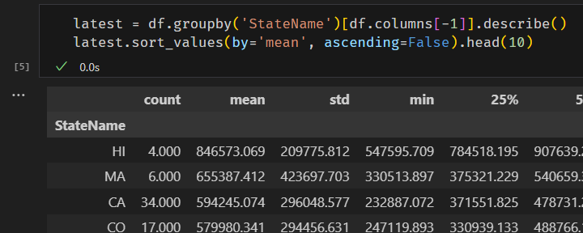
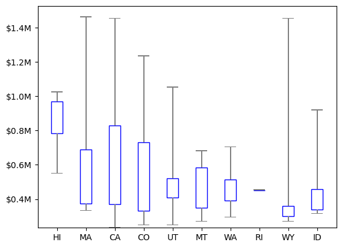
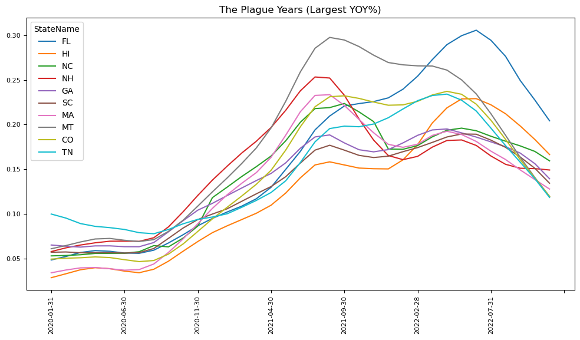
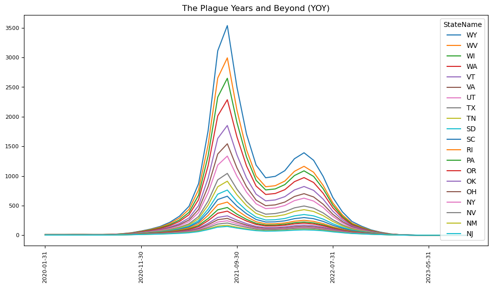

# Data Exploration Overview

This repo is part of a series of two-week projects in which I incorporate new skills into my toolkit. However, I readily
confess that this project didn't get quite as much attention as the previous ones, in part due to a pressing need for
better sleep habits.

Here are some questions that I’d like to answer:

* How did the pandemic affect home prices across the country?
* How might I visualize changes in the real estate market on a map over time?
* Where is the real estate market strongest and weakest currently?
* What factors could contribute to fluctuations in home prices?
* How do raw property sales prices compare to seasonally adjusted figures?
* Is it possible to predict movement in asking prices, generally?

For this project, I am using data provided by Zillow in their free
[Zillow Home Value Index (ZHVI)](https://www.zillow.com/research/data/) dataset, which contains home prices in the US
(by zip code and home size) from January 2000 onwards. I will also be using the standard libraries for data analysis in
Python: **pandas** and **matplotlib**.

[Software Demo Video](https://youtu.be/sA-6m31iCD8)

## Data Analysis Results

These are the questions I was able to answer during my investigation. See the Jupyter Notebooks for details on how they
were calculated.

### **Question**: Which state shows the highest mean (average) price? **Answer**: Hawaii



Does this mean (pun intended) that Hawaii is the clear front-runner for home prices? **Not at all.** The mean is a terrible
metric all by itself. For one thing, we have no idea how many house prices fall far above or far below this value. For
that, we need to consider the Standard Deviation, which describes the spread of the data.

### **Question**. Is Hawaii the most expensive place to live? **Answer**: Not necessarily



From this graph, we can see that the spread of house prices in Hawaii is more uniform than other states, but **Massachusets**,
**California**, and **Wyoming** all have higher maximums. It still doesn't feel like we've got a clear picture.

**NOTE** Keep in mind that we are not actually comparing all home prices in a state. We are only comparing differences between
MSA regions. For example, **Rhode Island** only has one MSA region, and therefore has no spread at all.

### **Question**: Which state saw the largest percentage gain in home prices through the pandemic? **Answer**: Florida



So far, we've been looking at differences in terms of real numbers. But when comparing a large economy to a smaller one,
it's better to use percentages. Now that we can compare states more equitably, in terms of percentage gain, we find that
**Hawaii** no longer leads the pack.

### **Question**: Who is the clear winner of the pandemic migration and housing boom? **Answer**: No one



To satisfy my own curiosity, I wanted to see if these pandemic gains carried through into 2023. If accurate, the
following chart represents the largest real estate bubble the U.S. has ever seen. It also indicates that nearly all
of the gains vanished by 2023.

## Development Environment

Unlike previous projects, the output of this repo is not running code. Rather, I am using tools designed for data
science, Python libraries and Jupyter Notebooks. Rather than focusing on a finished product, I am going to show how I
came to my conclusions through a series of steps.

* [Anaconda 3](https://www.anaconda.com/download/)
* [Python](https://marketplace.visualstudio.com/items?itemName=ms-python.python)
* [Jupyter](https://marketplace.visualstudio.com/items?itemName=ms-toolsai.jupyter)
* [markdownlint](https://marketplace.visualstudio.com/items?itemName=DavidAnson.vscode-markdownlint)
* [Code Spell Checker](https://marketplace.visualstudio.com/items?itemName=streetsidesoftware.code-spell-checker)

> To work with Python in Jupyter Notebooks, you must activate an Anaconda environment in VS Code. To select an
environment, use the **Python: Select Interpreter** command from the **Command Palette (Ctrl+Shift+P)**. Once the
appropriate environment is activated, you can create and open a Jupyter Notebook, connect to a remote Jupyter server
for running code cells, and export a Jupyter Notebook as a Python file.

I am using Conda this time to build my virtual environment. By default, the **Python: Create Environment...** command
will create a new folder named `.conda` in the root of your project. You can activate this environment with:

```powershell
activate .\.conda
```

Since the environment is unnamed, installing packages into this environment requires you to specify its prefix, like so:

```powershell
conda install -p .\.conda\ pandas requests
```

If you would rather create the environment manually, you can use the `requirements.txt` at the command line.

```powershell
conda create -p .\.conda -f requirements.txt
```

The `requirements.txt` file was created by running the command:

```powershell
conda list --export > requirements.txt
```

## ipykernel

The Run by Line and Debugging features for Python notebooks requires ipykernel v6.0.0 or greater to be installed in the
notebook's kernel. If you attempt to run the notebook without it, VS Code will prompt you to install it.

## Useful Websites

Here's a list of websites that I found helpful in this project.

* [Jupyter Notebooks in VS Code](https://code.visualstudio.com/docs/datascience/jupyter-notebooks)
* [Setting Up Run by Line and Debugging for Notebooks](https://github.com/microsoft/vscode-jupyter/wiki/Setting-Up-Run-by-Line-and-Debugging-for-Notebooks)
* [ZHVI User Guide](https://www.zillow.com/research/zhvi-user-guide/)
* [Zillow Home Value Index Methodology, 2023 Revision: What's Changed?](https://www.zillow.com/research/methodology-neural-zhvi-32128/)

## Future Work

Here's a  list of things that I would improve and add in the future.

* **Animation**. Build a data animation of yearly gains and losses.
* **Map it**. Display the data on a map of the U.S.
* **Merge datasets**. Combine with data from the Census or other government agencies.
* **Highlight events**. Highlight events on the timeline to give further data context.
